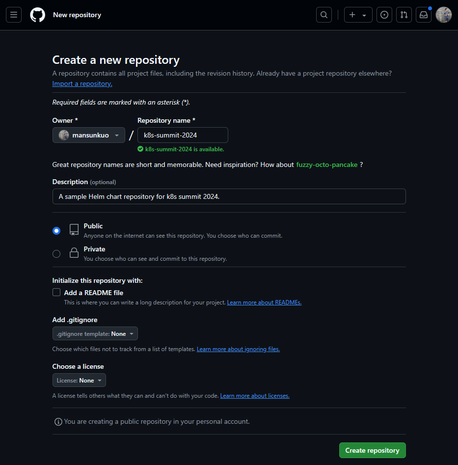
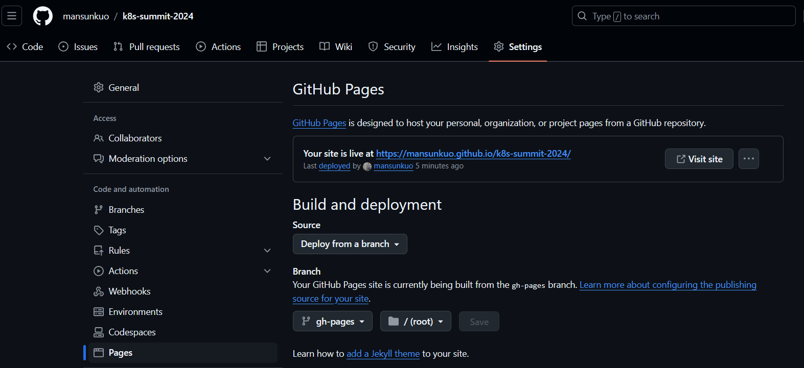

This article is about the workshop I conducted at the Kubernetes Summit 2024 in Taiwan. In this practical workshop, we will introduce a standard Helm Chart directory structure and the basic settings of its various components. I will guide you through creating your own Helm Chart from scratch, using Helm Template and Helm Dependency to write an easy-to-use and scalable Helm Chart. We will also use GitHub Pages and GitHub Actions to help share the latest version of your Helm Chart more easily through Helm Repo. The article is lengthy, so please make good use of the table of contents to quickly jump to the sections you want to explore.

## Environment Setup
### Git
Please refer to Getting Started - Installing Git, and make sure the `git` command is added to your environment variable PATH. Once installed successfully, you can use `git` in your command line:
```bash
❯ git version
git version 2.43.0
```
> This course will use Ubuntu 24.04 for instruction. If you encounter issues with environment variables on Windows, you can refer to [this article](https://stackoverflow.com/questions/4492979/error-git-is-not-recognized-as-an-internal-or-external-command) for configuration help.

### Kubernetes
This workshop will require a Kubernetes cluster and a namespace that has permission to read and write Secret objects. If you don’t have your own Kubernetes cluster, one convenient method is to install Docker Desktop on your personal computer:
- [Mac](https://docs.docker.com/desktop/install/mac-install/)
- [Windows](https://docs.docker.com/desktop/install/windows-install/)
- [Linux](https://docs.docker.com/desktop/install/linux-install/)

Enable the included [Kubernetes](https://docs.docker.com/desktop/kubernetes/) feature, which will also be used in this course.

If your environment doesn't have `kubectl` yet, please follow the instructions at [Install and Set Up kubectl](https://kubernetes.io/docs/tasks/tools/#kubectl). After installation, you should be able to use `kubectl` in your command line:
```bash
❯ kubectl version
Client Version: v1.30.2
Kustomize Version: v5.0.4-0.20230601165947-6ce0bf390ce3
Server Version: v1.30.2
```

### Helm
Please follow [Installing Helm](https://helm.sh/docs/intro/install/) to install Helm. Once successfully set up, you can use `helm` in your command line:
```bash
❯ helm version
version.BuildInfo{Version:"v3.15.2", GitCommit:"1a500d5625419a524fdae4b33de351cc4f58ec35", GitTreeState:"clean", GoVersion:"go1.22.4"}
```

## Exercise 1: Create Your First Helm Chart

Let's create a folder called `k8s-summit-2024`:
```bash
REPO_NAME=k8s-summit-2024
mkdir $REPO_NAME
cd $REPO_NAME
git init
```

To create a new Helm chart called myapi, you can use the following command:
```bash
mkdir charts
helm create charts/myapi
```

Helm generates a default structure for a new chart with several files and directories:
```bash
charts/myapi/
  ├── charts/
  ├── templates/
  ├── values.yaml
  ├── Chart.yaml
  └── ...
```

Here's an explanation of each file and folder:

### Common Files in a Helm Chart
#### Chart.yaml

This file contains metadata about the Helm chart, including the chart's name, version, and other descriptive information.


```yaml
apiVersion: v2
name: myapi
description: A Helm chart for Kubernetes

# A chart can be either an 'application' or a 'library' chart.
#
# Application charts are a collection of templates that can be packaged into versioned archives
# to be deployed.
#
# Library charts provide useful utilities or functions for the chart developer. They're included as
# a dependency of application charts to inject those utilities and functions into the rendering
# pipeline. Library charts do not define any templates and therefore cannot be deployed.
type: application

# This is the chart version. This version number should be incremented each time you make changes
# to the chart and its templates, including the app version.
# Versions are expected to follow Semantic Versioning (https://semver.org/)
version: 0.1.0

# This is the version number of the application being deployed. This version number should be
# incremented each time you make changes to the application. Versions are not expected to
# follow Semantic Versioning. They should reflect the version the application is using.
# It is recommended to use it with quotes.
appVersion: "1.16.0"
```


#### values.yaml

This file defines default values for your chart. It includes configurations such as replica counts, image information, service configurations, etc. These values can be overridden when installing the chart by passing your own values.yaml.


```yaml
# Default values for myapi.
# This is a YAML-formatted file.
# Declare variables to be passed into your templates.

replicaCount: 1

image:
  repository: nginx
  pullPolicy: IfNotPresent
  # Overrides the image tag whose default is the chart appVersion.
  tag: ""

imagePullSecrets: []
nameOverride: ""
fullnameOverride: ""

serviceAccount:
  # Specifies whether a service account should be created
  create: true
  # Automatically mount a ServiceAccount's API credentials?
  automount: true
  # Annotations to add to the service account
  annotations: {}
  # The name of the service account to use.
  # If not set and create is true, a name is generated using the fullname template
  name: ""

podAnnotations: {}
podLabels: {}

podSecurityContext: {}
  # fsGroup: 2000

securityContext: {}
  # capabilities:
  #   drop:
  #   - ALL
  # readOnlyRootFilesystem: true
  # runAsNonRoot: true
  # runAsUser: 1000

service:
  type: ClusterIP
  port: 80

ingress:
  enabled: false
  className: ""
  annotations: {}
    # kubernetes.io/ingress.class: nginx
    # kubernetes.io/tls-acme: "true"
  hosts:
    - host: chart-example.local
      paths:
        - path: /
          pathType: ImplementationSpecific
  tls: []
  #  - secretName: chart-example-tls
  #    hosts:
  #      - chart-example.local

resources: {}
  # We usually recommend not to specify default resources and to leave this as a conscious
  # choice for the user. This also increases chances charts run on environments with little
  # resources, such as Minikube. If you do want to specify resources, uncomment the following
  # lines, adjust them as necessary, and remove the curly braces after 'resources:'.
  # limits:
  #   cpu: 100m
  #   memory: 128Mi
  # requests:
  #   cpu: 100m
  #   memory: 128Mi

livenessProbe:
  httpGet:
    path: /
    port: http
readinessProbe:
  httpGet:
    path: /
    port: http

autoscaling:
  enabled: false
  minReplicas: 1
  maxReplicas: 100
  targetCPUUtilizationPercentage: 80
  # targetMemoryUtilizationPercentage: 80

# Additional volumes on the output Deployment definition.
volumes: []
# - name: foo
#   secret:
#     secretName: mysecret
#     optional: false

# Additional volumeMounts on the output Deployment definition.
volumeMounts: []
# - name: foo
#   mountPath: "/etc/foo"
#   readOnly: true

nodeSelector: {}

tolerations: []

affinity: {}
```


#### templates/
This directory contains Kubernetes manifest templates that Helm uses to generate Kubernetes resources. Helm will render these templates by substituting the values from values.yaml.

Helm has already prepared some typical files like deployment, hpa, ingress, service and serviceaccount for you. Besides standard Kubernetes objects, there are some special files in this folder:

##### _helpers.tpl
A file used to define reusable template snippets and helper functions, commonly used for naming conventions.


```go
{{/*
Expand the name of the chart.
*/}}
{{- define "myapi.name" -}}
{{- default .Chart.Name .Values.nameOverride | trunc 63 | trimSuffix "-" }}
{{- end }}

{{/*
Create a default fully qualified app name.
We truncate at 63 chars because some Kubernetes name fields are limited to this (by the DNS naming spec).
If release name contains chart name it will be used as a full name.
*/}}
{{- define "myapi.fullname" -}}
{{- if .Values.fullnameOverride }}
{{- .Values.fullnameOverride | trunc 63 | trimSuffix "-" }}
{{- else }}
{{- $name := default .Chart.Name .Values.nameOverride }}
{{- if contains $name .Release.Name }}
{{- .Release.Name | trunc 63 | trimSuffix "-" }}
{{- else }}
{{- printf "%s-%s" .Release.Name $name | trunc 63 | trimSuffix "-" }}
{{- end }}
{{- end }}
{{- end }}

{{/*
Create chart name and version as used by the chart label.
*/}}
{{- define "myapi.chart" -}}
{{- printf "%s-%s" .Chart.Name .Chart.Version | replace "+" "_" | trunc 63 | trimSuffix "-" }}
{{- end }}

{{/*
Common labels
*/}}
{{- define "myapi.labels" -}}
helm.sh/chart: {{ include "myapi.chart" . }}
{{ include "myapi.selectorLabels" . }}
{{- if .Chart.AppVersion }}
app.kubernetes.io/version: {{ .Chart.AppVersion | quote }}
{{- end }}
app.kubernetes.io/managed-by: {{ .Release.Service }}
{{- end }}

{{/*
Selector labels
*/}}
{{- define "myapi.selectorLabels" -}}
app.kubernetes.io/name: {{ include "myapi.name" . }}
app.kubernetes.io/instance: {{ .Release.Name }}
{{- end }}

{{/*
Create the name of the service account to use
*/}}
{{- define "myapi.serviceAccountName" -}}
{{- if .Values.serviceAccount.create }}
{{- default (include "myapi.fullname" .) .Values.serviceAccount.name }}
{{- else }}
{{- default "default" .Values.serviceAccount.name }}
{{- end }}
{{- end }}
```


##### tests/test-connection.yaml
A simple test resource for verifying the chart installation by checking service connectivity.


```yaml
apiVersion: v1
kind: Pod
metadata:
  name: "{{ include "myapi.fullname" . }}-test-connection"
  labels:
    {{- include "myapi.labels" . | nindent 4 }}
  annotations:
    "helm.sh/hook": test
spec:
  containers:
    - name: wget
      image: busybox
      command: ['wget']
      args: ['{{ include "myapi.fullname" . }}:{{ .Values.service.port }}']
  restartPolicy: Never
```



##### NOTES.txt
The NOTES.txt file in a Helm chart provides helpful information or instructions for the user after installation. When a Helm chart is successfully deployed, the contents of NOTES.txt will be displayed in the output.


```go
1. Get the application URL by running these commands:
{{- if .Values.ingress.enabled }}
{{- range $host := .Values.ingress.hosts }}
  {{- range .paths }}
  http{{ if $.Values.ingress.tls }}s{{ end }}://{{ $host.host }}{{ .path }}
  {{- end }}
{{- end }}
{{- else if contains "NodePort" .Values.service.type }}
  export NODE_PORT=$(kubectl get --namespace {{ .Release.Namespace }} -o jsonpath="{.spec.ports[0].nodePort}" services {{ include "myapi.fullname" . }})
  export NODE_IP=$(kubectl get nodes --namespace {{ .Release.Namespace }} -o jsonpath="{.items[0].status.addresses[0].address}")
  echo http://$NODE_IP:$NODE_PORT
{{- else if contains "LoadBalancer" .Values.service.type }}
     NOTE: It may take a few minutes for the LoadBalancer IP to be available.
           You can watch its status by running 'kubectl get --namespace {{ .Release.Namespace }} svc -w {{ include "myapi.fullname" . }}'
  export SERVICE_IP=$(kubectl get svc --namespace {{ .Release.Namespace }} {{ include "myapi.fullname" . }} --template "{{"{{ range (index .status.loadBalancer.ingress 0) }}{{.}}{{ end }}"}}")
  echo http://$SERVICE_IP:{{ .Values.service.port }}
{{- else if contains "ClusterIP" .Values.service.type }}
  export POD_NAME=$(kubectl get pods --namespace {{ .Release.Namespace }} -l "app.kubernetes.io/name={{ include "myapi.name" . }},app.kubernetes.io/instance={{ .Release.Name }}" -o jsonpath="{.items[0].metadata.name}")
  export CONTAINER_PORT=$(kubectl get pod --namespace {{ .Release.Namespace }} $POD_NAME -o jsonpath="{.spec.containers[0].ports[0].containerPort}")
  echo "Visit http://127.0.0.1:8080 to use your application"
  kubectl --namespace {{ .Release.Namespace }} port-forward $POD_NAME 8080:$CONTAINER_PORT
{{- end }}
```


##### .helmignore
This file defines patterns for files and directories that should be excluded when packaging the chart (similar to .gitignore).


```bash
# Patterns to ignore when building packages.
# This supports shell glob matching, relative path matching, and
# negation (prefixed with !). Only one pattern per line.
.DS_Store
# Common VCS dirs
.git/
.gitignore
.bzr/
.bzrignore
.hg/
.hgignore
.svn/
# Common backup files
*.swp
*.bak
*.tmp
*.orig
*~
# Various IDEs
.project
.idea/
*.tmproj
.vscode/
```


#### charts/
This directory is used to store any dependent charts. If your chart relies on other charts (e.g., a database), those charts can be placed here.

### Install a Local Helm Chart
To install the Helm chart without changing directories, you can specify the full path to the chart when running the helm install command. For example, to install a Helm release called `myapi-release`:


```bash
❯ helm install myapi-release ./charts/myapi
NAME: myapi-release
LAST DEPLOYED: Wed Sep 18 01:48:22 2024
NAMESPACE: default
STATUS: deployed
REVISION: 1
NOTES:
1. Get the application URL by running these commands:
  export POD_NAME=$(kubectl get pods --namespace default -l "app.kubernetes.io/name=myapi,app.kubernetes.io/instance=myapi-release" -o jsonpath="{.items[0].metadata.name}")
  export CONTAINER_PORT=$(kubectl get pod --namespace default $POD_NAME -o jsonpath="{.spec.containers[0].ports[0].containerPort}")
  echo "Visit http://127.0.0.1:8080 to use your application"
  kubectl --namespace default port-forward $POD_NAME 8080:$CONTAINER_PORT
```


Here are some commands you can use to check the status and details of your Helm releases and the resources they have deployed:

#### List Installed Helm Releases
This command lists all of the releases for a specified namespace (uses current namespace context if namespace not specified). For example:


```bash
❯ helm list
NAME            NAMESPACE       REVISION        UPDATED                                        STATUS          CHART           APP VERSION
myapi-release   default         1               2024-09-18 01:48:22.904366277 +0800 CST        deployed        myapi-0.1.0     1.16.0
```


#### Get Detailed Information About a Specific Helm Release
This command shows the status of a named release. For example:


```bash
❯ helm status myapi-release
NAME: myapi-release
LAST DEPLOYED: Wed Sep 18 01:48:22 2024
NAMESPACE: default
STATUS: deployed
REVISION: 1
NOTES:
1. Get the application URL by running these commands:
  export POD_NAME=$(kubectl get pods --namespace default -l "app.kubernetes.io/name=myapi,app.kubernetes.io/instance=myapi-release" -o jsonpath="{.items[0].metadata.name}")
  export CONTAINER_PORT=$(kubectl get pod --namespace default $POD_NAME -o jsonpath="{.spec.containers[0].ports[0].containerPort}")
  echo "Visit http://127.0.0.1:8080 to use your application"
  kubectl --namespace default port-forward $POD_NAME 8080:$CONTAINER_PORT
```


You can copy and paste the notes provides by the Helm chart and visit [http://127.0.0.1:8080](http://127.0.0.1:8080). It is a typical welcome page of nginx. 

> If you are using PowerShell, you may need to translate the notes . For example:
> ```powershell
> $POD_NAME=$(kubectl get pods --namespace default -l "app.kubernetes.io/name=myapi,app.kubernetes.io/instance=myapi-release" -o jsonpath="{.items[0].metadata.name}")
> $CONTAINER_PORT=$(kubectl get pod --namespace default $POD_NAME -o jsonpath="{.spec.containers[0].ports[0].containerPort}")
> ```

#### Get All Resources Created by the Helm Chart


```bash
❯ kubectl get all -l app.kubernetes.io/instance=myapi-release
NAME                                 READY   STATUS    RESTARTS   AGE
pod/myapi-release-54b5c4d9c8-lgwvl   1/1     Running   0          2m19s

NAME                    TYPE        CLUSTER-IP    EXTERNAL-IP   PORT(S)   AGE
service/myapi-release   ClusterIP   10.97.28.62   <none>        80/TCP    2m19s

NAME                            READY   UP-TO-DATE   AVAILABLE   AGE
deployment.apps/myapi-release   1/1     1            1           2m19s

NAME                                       DESIRED   CURRENT   READY   AGE
replicaset.apps/myapi-release-54b5c4d9c8   1         1         1       2m19s
```


This command lists all Kubernetes resources that have the label `app.kubernetes.io/instance=myapi-release`. This label typically indicates that these resources are part of a specific Helm release or application instance.

## Exercise 2: Modify It as an API
In this exercise, we will modify this Helm chart to create an API instance of [FastAPI](https://fastapi.tiangolo.com/).

### Add API Endpoints
Let's add API endpoints in a ConfigMap using. Embedding your FastAPI application code directly into a ConfigMap is unconventional, as ConfigMaps are meant for configuration data rather than application code. We do this here to simplify the process of building our own image. Please don't do this in your formal environment.


```yaml
apiVersion: v1
kind: ConfigMap
metadata:
  name: {{ include "myapi.fullname" . }}
  labels:
    {{- include "myapi.labels" . | nindent 4 }}
data:
  main.py: |
    from fastapi import FastAPI

    app = FastAPI()

    @app.get("/")
    def read_root():
        return {"Hello": "World"}

    @app.get("/hello/{user}")
    def hello(user: str):
        return {"Hello": user}
```


This code is a simple FastAPI web application with two endpoints: 
- **Root endpoint** (`/`): When someone accesses this URL with a GET request, the app returns a static JSON response, like `{"Hello": "World"}`. This is a simple welcome message.
- **Dynamic "hello" endpoint** (`/hello/{user}`): The URL takes a name or value (like a username) as part of the path. For example, accessing `/hello/mansun` will pass "mansun" to the function, and the app will respond with a personalized message: `{"Hello": "mansun"}`.

### Replace the Container Image and Expose the Command and Arguments 
Let's modify the values.yaml of our Helm chart.


```diff
diff --git a/charts/myapi/values.yaml b/charts/myapi/values.yaml
index fa277c8..288c7d3 100644
--- a/charts/myapi/values.yaml
+++ b/charts/myapi/values.yaml
@@ -5,10 +5,14 @@
 replicaCount: 1
 
 image:
-  repository: nginx
+  repository: tiangolo/uvicorn-gunicorn-fastapi
   pullPolicy: IfNotPresent
   # Overrides the image tag whose default is the chart appVersion.
-  tag: ""
+  tag: python3.11-slim
+
+# Command and args of the container
+command: ["uvicorn"]
+args: ["main:app", "--host", "0.0.0.0", "--port", "8080"]
 
 imagePullSecrets: []
 nameOverride: ""
@@ -39,6 +43,7 @@ securityContext: {}
   # runAsNonRoot: true
   # runAsUser: 1000
 
+containerPort: 8080
 service:
   type: ClusterIP
   port: 80
```


This diff compares changes made to the `values.yaml` file of a Helm chart, specifically for the `myapi` application. Here’s what was changed:

1. Image Repository  
The image was updated to `tiangolo/uvicorn-gunicorn-fastapi`, which is a commonly pre-built image for running FastAPI applications. You can find all available images in [tiangolo/uvicorn-gunicorn-fastapi](https://hub.docker.com/r/tiangolo/uvicorn-gunicorn-fastapi). We choose the latest slim version. This reflects a transition from serving static files (with Nginx) to running a FastAPI application.

2. Image Tag  
The tag was explicitly set to `python3.11-slim`, which ensures the application will run on this specific lightweight Python 3.11 image.

3. Command and Arguments  
The `command` and `args` fields were added. This specifies that when the container starts, it will run `uvicorn`, which is the ASGI server for FastAPI. It is configured to run the FastAPI application (`main:app`) on host `0.0.0.0` and port `8080`.

4. Container Port  
A `containerPort` field was added, setting the port inside the container to `8080`. This ensures the FastAPI application will be accessible on that port.

The changes reflect a transition from using an Nginx container to using a FastAPI container with Uvicorn. The container is now configured to run a FastAPI app at port 8080, with the image explicitly set to `python3.11-slim`.


The modified file will be:

```yaml
# Default values for myapi.
# This is a YAML-formatted file.
# Declare variables to be passed into your templates.

replicaCount: 1

image:
  repository: tiangolo/uvicorn-gunicorn-fastapi
  pullPolicy: IfNotPresent
  # Overrides the image tag whose default is the chart appVersion.
  tag: python3.11-slim

# Command and args of the container
command: ["uvicorn"]
args: ["main:app", "--host", "0.0.0.0", "--port", "8080"]

imagePullSecrets: []
nameOverride: ""
fullnameOverride: ""

serviceAccount:
  # Specifies whether a service account should be created
  create: true
  # Automatically mount a ServiceAccount's API credentials?
  automount: true
  # Annotations to add to the service account
  annotations: {}
  # The name of the service account to use.
  # If not set and create is true, a name is generated using the fullname template
  name: ""

podAnnotations: {}
podLabels: {}

podSecurityContext: {}
  # fsGroup: 2000

securityContext: {}
  # capabilities:
  #   drop:
  #   - ALL
  # readOnlyRootFilesystem: true
  # runAsNonRoot: true
  # runAsUser: 1000

containerPort: 8080
service:
  type: ClusterIP
  port: 80

ingress:
  enabled: false
  className: ""
  annotations: {}
    # kubernetes.io/ingress.class: nginx
    # kubernetes.io/tls-acme: "true"
  hosts:
    - host: chart-example.local
      paths:
        - path: /
          pathType: ImplementationSpecific
  tls: []
  #  - secretName: chart-example-tls
  #    hosts:
  #      - chart-example.local

resources: {}
  # We usually recommend not to specify default resources and to leave this as a conscious
  # choice for the user. This also increases chances charts run on environments with little
  # resources, such as Minikube. If you do want to specify resources, uncomment the following
  # lines, adjust them as necessary, and remove the curly braces after 'resources:'.
  # limits:
  #   cpu: 100m
  #   memory: 128Mi
  # requests:
  #   cpu: 100m
  #   memory: 128Mi

livenessProbe:
  httpGet:
    path: /
    port: http
readinessProbe:
  httpGet:
    path: /
    port: http

autoscaling:
  enabled: false
  minReplicas: 1
  maxReplicas: 100
  targetCPUUtilizationPercentage: 80
  # targetMemoryUtilizationPercentage: 80

# Additional volumes on the output Deployment definition.
volumes: []
# - name: foo
#   secret:
#     secretName: mysecret
#     optional: false

# Additional volumeMounts on the output Deployment definition.
volumeMounts: []
# - name: foo
#   mountPath: "/etc/foo"
#   readOnly: true

nodeSelector: {}

tolerations: []

affinity: {}

```



### Mount Volume and Refine Depoloyment

```diff
diff --git a/charts/myapi/templates/deployment.yaml b/charts/myapi/templates/deployment.yaml
index 8012d09..ae95687 100644
--- a/charts/myapi/templates/deployment.yaml
+++ b/charts/myapi/templates/deployment.yaml
@@ -36,9 +36,11 @@ spec:
             {{- toYaml .Values.securityContext | nindent 12 }}
           image: "{{ .Values.image.repository }}:{{ .Values.image.tag | default .Chart.AppVersion }}"
           imagePullPolicy: {{ .Values.image.pullPolicy }}
+          command: {{ toYaml .Values.command  | nindent 10 }}
+          args: {{ toYaml .Values.args | nindent 10 }}
           ports:
             - name: http
-              containerPort: {{ .Values.service.port }}
+              containerPort: {{ .Values.containerPort }}
               protocol: TCP
           livenessProbe:
             {{- toYaml .Values.livenessProbe | nindent 12 }}
@@ -46,12 +48,20 @@ spec:
             {{- toYaml .Values.readinessProbe | nindent 12 }}
           resources:
             {{- toYaml .Values.resources | nindent 12 }}
-          {{- with .Values.volumeMounts }}
           volumeMounts:
+            - name: app-code
+              mountPath: /app
+          {{- with .Values.volumeMounts }}
             {{- toYaml . | nindent 12 }}
           {{- end }}
-      {{- with .Values.volumes }}
       volumes:
+        - name: app-code
+          configMap:
+            name: {{ include "myapi.fullname" . }}
+            items:
+            - key: main.py
+              path: main.py
+      {{- with .Values.volumes }}
         {{- toYaml . | nindent 8 }}
       {{- end }}
       {{- with .Values.nodeSelector }}
```


Here's an explanation of the key changes:
1. New Command and Args Section  
Adds the `command` and `args` fields to the container specification, allowing you to override the default container entry point and arguments via Helm values (`.Values.command` and `.Values.args`).
2. Port Reference Update  
Alters where the port value is pulled from. Instead of using `.Values.service.port`, it now uses `.Values.containerPort`.
3. App Code Volume Mount  
Mounts a volume named `app-code` to the `/app` directory inside the container. 
4. App Code Volume Definition  
A new volume named `app-code` is defined, which references a ConfigMap that contains `main.py`. This ConfigMap is included via the `myapi.fullname` helper template, and the key `main.py` is mounted as `main.py` in the container.
5. Reorganized volumes and volumeMounts Blocks  
A new mount (`app-code`) is introduced, and existing volumeMounts and volumes are still handled using the `with` directive for any additional values in `.Values.volumeMounts` and `.Values.volumes`.


### Upgrade the Helm Release

Let's upgrade the Helm release to make our new API available:
```bash
helm upgrade --install myapi-release ./charts/myapi
```


```bash
❯ helm upgrade --install myapi-release ./charts/myapi
Release "myapi-release" has been upgraded. Happy Helming!
NAME: myapi-release
LAST DEPLOYED: Wed Sep 18 01:42:07 2024
NAMESPACE: default
STATUS: deployed
REVISION: 5
NOTES:
1. Get the application URL by running these commands:
  export POD_NAME=$(kubectl get pods --namespace default -l "app.kubernetes.io/name=myapi,app.kubernetes.io/instance=myapi-release" -o jsonpath="{.items[0].metadata.name}")
  export CONTAINER_PORT=$(kubectl get pod --namespace default $POD_NAME -o jsonpath="{.spec.containers[0].ports[0].containerPort}")
  echo "Visit http://127.0.0.1:8080 to use your application"
  kubectl --namespace default port-forward $POD_NAME 8080:$CONTAINER_PORT
```


Copy and pase the command in a terminal to forward the port of API pod:


```bash
❯ export POD_NAME=$(kubectl get pods --namespace default -l "app.kubernetes.io/name=myapi,app.kubernetes.io/instance=myapi-release" -o jsonpath="{.items[0].metadata.name}")
  export CONTAINER_PORT=$(kubectl get pod --namespace default $POD_NAME -o jsonpath="{.spec.containers[0].ports[0].containerPort}")
  echo "Visit http://127.0.0.1:8080 to use your application"
  kubectl --namespace default port-forward $POD_NAME 8080:$CONTAINER_PORT
Visit http://127.0.0.1:8080 to use your application
Forwarding from 127.0.0.1:8080 -> 8080
Forwarding from [::1]:8080 -> 8080
```


Use another terminal to check your API:

```bash
❯ curl http://localhost:8080
{"Hello":"World"}%                                                             
❯ curl http://localhost:8080/hello/mansun
{"Hello":"mansun"}%
```


Let's check our k8s secrets:
```bash
❯ kubectl get secrets
NAME                                  TYPE                 DATA   AGE
sh.helm.release.v1.myapi-release.v1   helm.sh/release.v1   1      22m
sh.helm.release.v1.myapi-release.v2   helm.sh/release.v1   1      18m
```

`sh.helm.release.v1.myapi-release.v1` and `sh.helm.release.v1.myapi-release.v2` are secrets generated by Helm. These secrets store information about Helm releases. The suffixes .v1 and .v2 refer to different revisions of the Helm release. Each time a release is updated, a new secret is created.

The type of secret, `helm.sh/release.v1` is specific to Helm. Helm uses this type of secret to track the state of releases.

For example, it is possible to extract the manifest from the secret:

```yaml
❯ kubectl get secret sh.helm.release.v1.myapi-release.v2 \
  -o jsonpath="{.data.release}" | \
  base64 --decode | \
  base64 --decode | \
  gunzip | \
  jq -r .manifest
---
# Source: myapi/templates/serviceaccount.yaml
apiVersion: v1
kind: ServiceAccount
metadata:
  name: myapi-release
  labels:
    helm.sh/chart: myapi-0.1.0
    app.kubernetes.io/name: myapi
    app.kubernetes.io/instance: myapi-release
    app.kubernetes.io/version: "1.16.0"
    app.kubernetes.io/managed-by: Helm
automountServiceAccountToken: true
---
# Source: myapi/templates/configmap.yaml
apiVersion: v1
kind: ConfigMap
metadata:
  name: myapi-release
  labels:
    helm.sh/chart: myapi-0.1.0
    app.kubernetes.io/name: myapi
    app.kubernetes.io/instance: myapi-release
    app.kubernetes.io/version: "1.16.0"
    app.kubernetes.io/managed-by: Helm
data:
  main.py: |
    from fastapi import FastAPI

    app = FastAPI()

    @app.get("/")
    def read_root():
        return {"Hello": "World"}

    @app.get("/hello/{user}")
    def hello(user: str):
        return {"Hello": user}
---
# Source: myapi/templates/service.yaml
apiVersion: v1
kind: Service
metadata:
  name: myapi-release
  labels:
    helm.sh/chart: myapi-0.1.0
    app.kubernetes.io/name: myapi
    app.kubernetes.io/instance: myapi-release
    app.kubernetes.io/version: "1.16.0"
    app.kubernetes.io/managed-by: Helm
spec:
  type: ClusterIP
  ports:
    - port: 80
      targetPort: http
      protocol: TCP
      name: http
  selector:
    app.kubernetes.io/name: myapi
    app.kubernetes.io/instance: myapi-release
---
# Source: myapi/templates/deployment.yaml
apiVersion: apps/v1
kind: Deployment
metadata:
  name: myapi-release
  labels:
    helm.sh/chart: myapi-0.1.0
    app.kubernetes.io/name: myapi
    app.kubernetes.io/instance: myapi-release
    app.kubernetes.io/version: "1.16.0"
    app.kubernetes.io/managed-by: Helm
spec:
  replicas: 1
  selector:
    matchLabels:
      app.kubernetes.io/name: myapi
      app.kubernetes.io/instance: myapi-release
  template:
    metadata:
      labels:
        helm.sh/chart: myapi-0.1.0
        app.kubernetes.io/name: myapi
        app.kubernetes.io/instance: myapi-release
        app.kubernetes.io/version: "1.16.0"
        app.kubernetes.io/managed-by: Helm
    spec:
      serviceAccountName: myapi-release
      securityContext:
        {}
      containers:
        - name: myapi
          securityContext:
            {}
          image: "tiangolo/uvicorn-gunicorn-fastapi:python3.11-slim"
          imagePullPolicy: IfNotPresent
          command: 
          - uvicorn
          args: 
          - main:app
          - --host
          - 0.0.0.0
          - --port
          - "8080"
          ports:
            - name: http
              containerPort: 8080
              protocol: TCP
          livenessProbe:
            httpGet:
              path: /
              port: http
          readinessProbe:
            httpGet:
              path: /
              port: http
          resources:
            {}
          volumeMounts:
            - name: app-code
              mountPath: /app
      volumes:
        - name: app-code
          configMap:
            name: myapi-release
            items:
            - key: main.py
              path: main.py
```


It is a templated k8s objects of the release. That is why Helm can rollback our application to any release. 

Let's try to rollback to the original nginx version:
```bash
❯ helm rollback myapi-release 1
Rollback was a success! Happy Helming!
❯ helm ls
NAME            NAMESPACE       REVISION        UPDATED                                STATUS          CHART           APP VERSION
myapi-release   default         3               2024-09-18 02:34:03.72739722 +0800 CST deployed        myapi-0.1.0     1.16.0
```

Rollback to the FastAPI version:
```bash
❯ helm rollback myapi-release 2
Rollback was a success! Happy Helming!
❯ helm ls
NAME            NAMESPACE       REVISION        UPDATED                                        STATUS          CHART           APP VERSION
myapi-release   default         4               2024-09-18 02:38:42.936136839 +0800 CST        deployed        myapi-0.1.0     1.16.0
```

It populates a new revision from the revision you assigned.

## Exercise 3: Why My Secret Is Not Updated
Let's add a random passcode in our API.

### Add a Random Secret and Encode It
Helm provides a lot of handy [template functions and pipelines](https://helm.sh/docs/chart_template_guide/functions_and_pipelines/). You can find more useful template functions in [Template Function List](https://helm.sh/docs/chart_template_guide/function_list/). For example, here is a k8s secret object with a random 10-digit passcode. We also pipe it into another function that encode a string in base64 encoding. 


```yaml
apiVersion: v1
kind: Secret
metadata:
  name: {{ include "myapi.fullname" . }}
  labels:
    {{- include "myapi.labels" . | nindent 4 }}
type: Opaque
data:
  passcode: {{ randAlphaNum  10 | b64enc }}  # Generate a random 10-digit passcode and encode it in base64
```


### Mount the Secret on the Deployment
Let's mount our secret as an environment variable on the deployment. No special trick here, just remember to reuse template function, `myapi.fullname` which generated by `helm create`.

```diff
diff --git a/charts/myapi/templates/deployment.yaml b/charts/myapi/templates/deployment.yaml
index ae95687..172c1b5 100644
--- a/charts/myapi/templates/deployment.yaml
+++ b/charts/myapi/templates/deployment.yaml
@@ -38,6 +38,12 @@ spec:
           imagePullPolicy: {{ .Values.image.pullPolicy }}
           command: {{ toYaml .Values.command  | nindent 10 }}
           args: {{ toYaml .Values.args | nindent 10 }}
+          env:
+            - name: PASSCODE
+              valueFrom:
+                secretKeyRef:
+                  name: {{ include "myapi.fullname" . }}
+                  key: passcode
           ports:
             - name: http
               containerPort: {{ .Values.containerPort }}
```

### Consume the Environment Variable
```diff
diff --git a/charts/myapi/templates/configmap.yaml b/charts/myapi/templates/configmap.yaml
index 9d96063..0449698 100644
--- a/charts/myapi/templates/configmap.yaml
+++ b/charts/myapi/templates/configmap.yaml
@@ -6,13 +6,14 @@ metadata:
     {{- include "myapi.labels" . | nindent 4 }}
 data:
   main.py: |
+    import os
     from fastapi import FastAPI
 
     app = FastAPI()
 
     @app.get("/")
     def read_root():
-        return {"Hello": "World"}
+        return {"Hello": f"Your pass code is {os.environ.get('PASSCODE')}"}
 
     @app.get("/hello/{user}")
     def hello(user: str):
```

### Upgrade the Helm Release Again

Let's upgrade our Helm release again and check the contents of the secret:
```bash
helm upgrade --install myapi-release ./charts/myapi
kubectl get secret myapi-release -o jsonpath="{.data.passcode}" | base64 --decode
```

You can execute the above code snippet multiple times. The secret will change in every release, but your API will still be using the oldest secret.


```bash
❯ helm upgrade --install myapi-release ./charts/myapi
Release "myapi-release" has been upgraded. Happy Helming!
NAME: myapi-release
LAST DEPLOYED: Wed Sep 25 22:57:26 2024
NAMESPACE: default
STATUS: deployed
REVISION: 14
NOTES:
1. Get the application URL by running these commands:
  export POD_NAME=$(kubectl get pods --namespace default -l "app.kubernetes.io/name=myapi,app.kubernetes.io/instance=myapi-release" -o jsonpath="{.items[0].metadata.name}")
  export CONTAINER_PORT=$(kubectl get pod --namespace default $POD_NAME -o jsonpath="{.spec.containers[0].ports[0].containerPort}")
  echo "Visit http://127.0.0.1:8080 to use your application"
  kubectl --namespace default port-forward $POD_NAME 8080:$CONTAINER_PORT
❯ kubectl get secret myapi-release -o jsonpath="{.data.passcode}" | base64 --decode
XZB3yxL0Hv%                                                                    
❯ helm upgrade --install myapi-release ./charts/myapi
Release "myapi-release" has been upgraded. Happy Helming!
NAME: myapi-release
LAST DEPLOYED: Wed Sep 25 23:00:52 2024
NAMESPACE: default
STATUS: deployed
REVISION: 15
NOTES:
1. Get the application URL by running these commands:
  export POD_NAME=$(kubectl get pods --namespace default -l "app.kubernetes.io/name=myapi,app.kubernetes.io/instance=myapi-release" -o jsonpath="{.items[0].metadata.name}")
  export CONTAINER_PORT=$(kubectl get pod --namespace default $POD_NAME -o jsonpath="{.spec.containers[0].ports[0].containerPort}")
  echo "Visit http://127.0.0.1:8080 to use your application"
  kubectl --namespace default port-forward $POD_NAME 8080:$CONTAINER_PORT
❯ kubectl get secret myapi-release -o jsonpath="{.data.passcode}" | base64 --decode
RiNr1OQLMd%
```


### What's Wrong
Changes to ConfigMap or Secret objects that are referenced in a pod spec do not trigger a pod rollout on their own, even if the underlying data changes. This is because Kubernetes doesn't watch for changes to those resources by default. Let's add a little trick to make Helm [automatically roll deployments](https://helm.sh/docs/howto/charts_tips_and_tricks/#automatically-roll-deployments):


```diff
diff --git a/charts/myapi/templates/deployment.yaml b/charts/myapi/templates/deployment.yaml
index 172c1b5..1e324c8 100644
--- a/charts/myapi/templates/deployment.yaml
+++ b/charts/myapi/templates/deployment.yaml
@@ -13,8 +13,11 @@ spec:
       {{- include "myapi.selectorLabels" . | nindent 6 }}
   template:
     metadata:
-      {{- with .Values.podAnnotations }}
       annotations:
+        # https://helm.sh/docs/howto/charts_tips_and_tricks/#automatically-roll-deployments
+        checksum/config: {{ include (print $.Template.BasePath "/configmap.yaml") . | sha256sum }}
+        checksum/secret: {{ include (print $.Template.BasePath "/secret.yaml") . | sha256sum }}
+      {{- with .Values.podAnnotations }}
         {{- toYaml . | nindent 8 }}
       {{- end }}
       labels:
```


Helm will roll out the pod when the content of the deployment spec or the checksum annotations for ConfigMap or Secret change. By including the checksums of the ConfigMap and Secret, the deployment will automatically be rolled out whenever these files change. This ensures that the changes in configuration or secrets trigger a new pod deployment.

The whole deployment config will look like this:

```yaml
apiVersion: apps/v1
kind: Deployment
metadata:
  name: {{ include "myapi.fullname" . }}
  labels:
    {{- include "myapi.labels" . | nindent 4 }}
spec:
  {{- if not .Values.autoscaling.enabled }}
  replicas: {{ .Values.replicaCount }}
  {{- end }}
  selector:
    matchLabels:
      {{- include "myapi.selectorLabels" . | nindent 6 }}
  template:
    metadata:
      annotations:
        # https://helm.sh/docs/howto/charts_tips_and_tricks/#automatically-roll-deployments
        checksum/config: {{ include (print $.Template.BasePath "/configmap.yaml") . | sha256sum }}
        checksum/secret: {{ include (print $.Template.BasePath "/secret.yaml") . | sha256sum }}
      {{- with .Values.podAnnotations }}
        {{- toYaml . | nindent 8 }}
      {{- end }}
      labels:
        {{- include "myapi.labels" . | nindent 8 }}
        {{- with .Values.podLabels }}
        {{- toYaml . | nindent 8 }}
        {{- end }}
    spec:
      {{- with .Values.imagePullSecrets }}
      imagePullSecrets:
        {{- toYaml . | nindent 8 }}
      {{- end }}
      serviceAccountName: {{ include "myapi.serviceAccountName" . }}
      securityContext:
        {{- toYaml .Values.podSecurityContext | nindent 8 }}
      containers:
        - name: {{ .Chart.Name }}
          securityContext:
            {{- toYaml .Values.securityContext | nindent 12 }}
          image: "{{ .Values.image.repository }}:{{ .Values.image.tag | default .Chart.AppVersion }}"
          imagePullPolicy: {{ .Values.image.pullPolicy }}
          command: {{ toYaml .Values.command  | nindent 10 }}
          args: {{ toYaml .Values.args | nindent 10 }}
          env:
            - name: PASSCODE
              valueFrom:
                secretKeyRef:
                  name: {{ include "myapi.fullname" . }}
                  key: passcode
          ports:
            - name: http
              containerPort: {{ .Values.containerPort }}
              protocol: TCP
          livenessProbe:
            {{- toYaml .Values.livenessProbe | nindent 12 }}
          readinessProbe:
            {{- toYaml .Values.readinessProbe | nindent 12 }}
          resources:
            {{- toYaml .Values.resources | nindent 12 }}
          volumeMounts:
            - name: app-code
              mountPath: /app
          {{- with .Values.volumeMounts }}
            {{- toYaml . | nindent 12 }}
          {{- end }}
      volumes:
        - name: app-code
          configMap:
            name: {{ include "myapi.fullname" . }}
            items:
            - key: main.py
              path: main.py
      {{- with .Values.volumes }}
        {{- toYaml . | nindent 8 }}
      {{- end }}
      {{- with .Values.nodeSelector }}
      nodeSelector:
        {{- toYaml . | nindent 8 }}
      {{- end }}
      {{- with .Values.affinity }}
      affinity:
        {{- toYaml . | nindent 8 }}
      {{- end }}
      {{- with .Values.tolerations }}
      tolerations:
        {{- toYaml . | nindent 8 }}
      {{- end }}
```
 

## Exercise 4: Add a Helm Dependency
[Helm dependency](https://helm.sh/docs/helm/helm_dependency/) manage the dependencies of a chart. Helm charts store their dependencies in `charts/`. For chart developers, it is often easier to manage dependencies in `Chart.yaml` which declares all dependencies.

The dependency commands operate on that file, making it easy to synchronize between the desired dependencies and the actual dependencies stored in the `charts/` directory.

The [Bitnami Library for Kubernetes](https://github.com/bitnami/charts) is a Helm repository with various pre-packaged Kubernetes resources that make it easier to deploy common open-source applications and infrastructure components in Kubernetes clusters. There is a special chart, [Bitnami Common Library Chart](https://github.com/bitnami/charts/tree/main/bitnami/common), which groups common logic between Bitnami charts. Let's add it to our Helm chart.

### Add a Dependency

```diff
diff --git a/charts/myapi/Chart.yaml b/charts/myapi/Chart.yaml
index e1991d4..4b34b58 100644
--- a/charts/myapi/Chart.yaml
+++ b/charts/myapi/Chart.yaml
@@ -22,3 +22,8 @@ version: 0.1.0
 # follow Semantic Versioning. They should reflect the version the application is using.
 # It is recommended to use it with quotes.
 appVersion: "1.16.0"
+
+dependencies:
+  - name: common
+    version: 2.x.x
+    repository: oci://registry-1.docker.io/bitnamicharts
\ No newline at end of file
```


This change adds a dependency on a Helm chart named common from the Bitnami charts repository. `x` in `version` represents the latest version for major, minor, or patch in [Semantic Versioning](https://semver.org/). It allows any patch version under the major version 2

### Build Dependency
Let's refresh the Helm dependency based on `Chart.yaml`
```bash
❯ helm dependency update charts/myapi
Saving 1 charts
Downloading common from repo oci://registry-1.docker.io/bitnamicharts
Pulled: registry-1.docker.io/bitnamicharts/common:2.22.0
Digest: sha256:7e1d75e30a368544c724e480b8f375f702ecdd6933634a852b760660c6cbd588
Deleting outdated charts
```

This command will create a `Chart.lock` file. You can use `helm dependency build` to reconstruct a chart's dependencies to the state specified in the lock file. Here is a summary of the difference between `helm dependency build` and `helm dependency update`:

| **Command**              | **Works With**       | **Downloads Dependencies**        | **Updates Chart.lock**         | **Use Case**                                        |
|--------------------------|----------------------|-----------------------------------|-------------------------------|----------------------------------------------------|
| `helm dependency build`   | `Chart.lock`         | Based on the locked versions      | No                            | Install exact versions of dependencies as specified in the `Chart.lock` file for reproducibility. |
| `helm dependency update`  | `Chart.yaml`         | Based on the latest matching versions in `Chart.yaml` | Yes                           | Update dependencies to the latest matching versions as specified in `Chart.yaml`, and regenerate the `Chart.lock` file. |

It also generates a `charts/` forder which contains all dependencies for the chart. Starting from Helm 2.2.0, repository can be defined as the path to the directory of the dependency charts stored locally. The path should start with a prefix of "file://". For example:

```yaml
# Chart.yaml
dependencies:
- name: nginx
  version: "1.2.3"
  repository: "file://../dependency_chart/nginx"
```

If the dependency chart is retrieved locally or using OCI-based registries, it is not required to have the repository added to helm by using `helm add repo`. 

In our case, we are using an external dependency. We don't need to add the `*.tgz` files to our git repository. Let's add an .gitignore for it:
```bash
curl -o .gitignore https://raw.githubusercontent.com/bitnami/charts/refs/heads/main/.gitignore
``` 


```git
*.tgz
/.idea/*
.vscode
.DS_Store
```
 

### OCI-based Registries and Traditional Chart Repository
Beginning in Helm 3, you can use container registries with [OCI (Open Container Initiative)](https://opencontainers.org/) support to store and share chart packages. Beginning in Helm v3.8.0, OCI support is enabled by default. You don't need to use `helm repo add` for an OCI registry (`oci://`) because Helm interacts with OCI registries in a different way than with traditional Helm chart repositories.

Key Differences Between OCI-based registries and Helm Chart Repositories:
1. Traditional Helm Repositories:
    - Traditional Helm repositories use the `helm repo add` command to register the repository URL with Helm. This allows Helm to search, fetch, and install charts from the repository using a simple chart name and version.
    - Repositories store a `index.yaml` file that acts as a catalog of all the charts, which Helm uses to fetch charts by name.
2. OCI Registries:
    - OCI registries are more similar to Docker image registries (e.g., Docker Hub), where charts are stored as OCI artifacts.
    - You don't need an index file (like `index.yaml`) or a repository registration step (`helm repo add`). Instead, you can directly interact with the OCI registry using commands like `helm pull`, `helm push`, and `helm install` with the `oci://` scheme.

With OCI registries, Helm interacts directly with charts using the `oci://` scheme, bypassing the need for `helm repo add` and `index.yaml` files. This is more similar to working with Docker images than traditional Helm chart repositories.

### Apply the Dependency
Let's add a place holder of in `values.yaml`:


```diff
diff --git a/charts/myapi/values.yaml b/charts/myapi/values.yaml
index 288c7d3..a1e50b7 100644
--- a/charts/myapi/values.yaml
+++ b/charts/myapi/values.yaml
@@ -110,3 +110,6 @@ nodeSelector: {}
 tolerations: []
 
 affinity: {}
+
+secrets:
+  passcode: ""
\ No newline at end of file
```


And modify our passcode:

```diff
diff --git a/charts/myapi/templates/secret.yaml b/charts/myapi/templates/secret.yaml
index 6cd83d6..a81ce6b 100644
--- a/charts/myapi/templates/secret.yaml
+++ b/charts/myapi/templates/secret.yaml
@@ -1,9 +1,12 @@
+{{- $fullname := include "myapi.fullname" . }}
 apiVersion: v1
 kind: Secret
 metadata:
-  name: {{ include "myapi.fullname" . }}
+  name: {{ $fullname }}
   labels:
     {{- include "myapi.labels" . | nindent 4 }}
 type: Opaque
 data:
-  passcode: {{ randAlphaNum  10 | b64enc }}  # Generate a random 10-digit passcode and encode it in base64
+  # Generate secret password or retrieve one if already created.
+  # https://github.com/bitnami/charts/blob/07062ee01382e24b8204b27083ff3e8102110c2f/bitnami/common/templates/_secrets.tpl#L66-L142
+  passcode: {{ include "common.secrets.passwords.manage" (dict "secret" $fullname "key" "passcode" "providedValues" (list "secrets.passcode" ) "length" 10 "strong" false "chartName" "chartName" "context" $) }}
```


Let's break down the changes:
1. Introduction of a Variable for the `fullname`:

The `fullname` is now assigned to the `$fullname` variable with the line `{{- $fullname := include "myapi.fullname" . }}`. This allows for reusing `$fullname` throughout the template instead of repeating `{{ include "myapi.fullname" . }}` every time you need the full name. It improves readability when the full name needs to be used in multiple places.

2. Replacement of Simple Random Password with Managed Secret:

The simple random password generation (`randAlphaNum 10`) is replaced with Bitnami's `common.secrets.passwords.manage` function. The function is used to generate or retrieve a password. If the secret already exists (e.g., during an upgrade), it will retrieve the existing password, preventing unnecessary password changes. This enhances the security and flexibility of secret management. The secret can be reused across upgrades, ensuring consistency without generating new passwords every time. More description of the usage can refer to its [GitHub](https://github.com/bitnami/charts/blob/07062ee01382e24b8204b27083ff3e8102110c2f/bitnami/common/templates/_secrets.tpl#L66-L142)

Let's uninstall and install it again. We will get a random passcode:


```bash
❯ helm uninstall myapi-release
release "myapi-release" uninstalled
❯ helm upgrade --install myapi-release ./charts/myapi
Release "myapi-release" does not exist. Installing it now.
NAME: myapi-release
LAST DEPLOYED: Fri Sep 27 01:35:49 2024
NAMESPACE: default
STATUS: deployed
REVISION: 1
NOTES:
1. Get the application URL by running these commands:
  export POD_NAME=$(kubectl get pods --namespace default -l "app.kubernetes.io/name=myapi,app.kubernetes.io/instance=myapi-release" -o jsonpath="{.items[0].metadata.name}")
  export CONTAINER_PORT=$(kubectl get pod --namespace default $POD_NAME -o jsonpath="{.spec.containers[0].ports[0].containerPort}")
  echo "Visit http://127.0.0.1:8080 to use your application"
  kubectl --namespace default port-forward $POD_NAME 8080:$CONTAINER_PORT
❯ kubectl get secret myapi-release -o jsonpath="{.data.passcode}" | base64 --decode
x8ZdR8zBsQ%
```



We can also assign a desired value for it. When we install it again, the passcode is still the same.

```bash
❯ helm uninstall myapi-release
release "myapi-release" uninstalled
❯ helm upgrade --install myapi-release ./charts/myapi --set secrets.passcode=konosuba
Release "myapi-release" does not exist. Installing it now.
NAME: myapi-release
LAST DEPLOYED: Fri Sep 27 01:38:49 2024
NAMESPACE: default
STATUS: deployed
REVISION: 1
NOTES:
1. Get the application URL by running these commands:
  export POD_NAME=$(kubectl get pods --namespace default -l "app.kubernetes.io/name=myapi,app.kubernetes.io/instance=myapi-release" -o jsonpath="{.items[0].metadata.name}")
  export CONTAINER_PORT=$(kubectl get pod --namespace default $POD_NAME -o jsonpath="{.spec.containers[0].ports[0].containerPort}")
  echo "Visit http://127.0.0.1:8080 to use your application"
  kubectl --namespace default port-forward $POD_NAME 8080:$CONTAINER_PORT
❯ kubectl get secret myapi-release -o jsonpath="{.data.passcode}" | base64 --decode
konosuba%
❯ helm upgrade --install myapi-release ./charts/myapi
Release "myapi-release" has been upgraded. Happy Helming!
NAME: myapi-release
LAST DEPLOYED: Fri Sep 27 01:39:06 2024
NAMESPACE: default
STATUS: deployed
REVISION: 2
NOTES:
1. Get the application URL by running these commands:
  export POD_NAME=$(kubectl get pods --namespace default -l "app.kubernetes.io/name=myapi,app.kubernetes.io/instance=myapi-release" -o jsonpath="{.items[0].metadata.name}")
  export CONTAINER_PORT=$(kubectl get pod --namespace default $POD_NAME -o jsonpath="{.spec.containers[0].ports[0].containerPort}")
  echo "Visit http://127.0.0.1:8080 to use your application"
  kubectl --namespace default port-forward $POD_NAME 8080:$CONTAINER_PORT
❯ kubectl get secret myapi-release -o jsonpath="{.data.passcode}" | base64 --decode
konosuba%
```


## Exercise 5: Chart Releaser Action to Automate GitHub Page Charts
###  Setup Your GitHub Repository
In this exercise, we will publish out chart to GItHib pags with GitHub Action. First of all, you will need a new repository called `k8s-summit-2024`. Please follow step 1, 2, 3 and 5 in [Quickstart for GitHub Pages](https://docs.github.com/en/pages/quickstart) to create a blank repository called `k8s-summit-2024`:
- In the upper-right corner of any page, select `+`, then click **New repository**.
- Enter `k8s-summit-2024` as the repository name.
- Choose `Public` as the repository visibility.
- Add an optional description.
- Click **Create repository**. 




Follow the instruction of "push an existing repository from the command line". The `$USER` will be your GitHub account in the instruction:

```bash
git remote add origin git@github.com:$USER/k8s-summit-2024.git
git branch -M main
git push -u origin main
```

You also need a branch called `gh-pages` to ensure proper functionality. We will use this branch to host our charts. Let's create and checkout a new branch and push it to our repository. Remember to switch back to your main branch.

```bash
git checkout -b gh-pages
git push origin gh-pages
git checkout main
```

Follow step 6 to step 9 in [Quickstart for GitHub Pages](https://docs.github.com/en/pages/quickstart) to config your gh-pages:
- Under your repository name, click `Settings`. If you cannot see the `Settings` tab, select the  dropdown menu, then click `Settings`.
- In the "Code and automation" section of the sidebar, click `Pages`.
- Under "Build and deployment", under "Source", select `Deploy from a branch`.
- Under "Build and deployment", under "Branch", use the branch dropdown menu and select `gh-pages`.




### Final Adjustment for Your Helm Chart

Add `charts/myapi/README.md` for your Helm chart. Remember to replace following string:
- `<alias>` -> `$YOUR_GITHUB_ACCOUNT-k8s-summit-2024`
- `<orgname>` -> `$YOUR_GITHUB_ACCOUNT`
- `<chart-name>` -> `myapi`
- `helm-charts` -> `k8s-summit-2024`


```markdown
## Usage

[Helm](https://helm.sh) must be installed to use the charts.  Please refer to
Helm's [documentation](https://helm.sh/docs) to get started.

Once Helm has been set up correctly, add the repo as follows:

    helm repo add <alias> https://<orgname>.github.io/helm-charts

If you had already added this repo earlier, run `helm repo update` to retrieve the latest versions of the packages.  You can then run `helm search repo <alias>` to see the charts.

To install the <chart-name> chart:

    helm install <orgname>-<chart-name> <alias>/<chart-name>

To uninstall the chart:

    helm delete <orgname>-<chart-name>
```


> If you are using Mac/Linux and `$USER` is exactly equal to your GitHub account, you can copy and paste following command:
> 
```bash
# Define variables
ALIAS=$USER-k8s-summit-2024
ORGNAME=$USER
CHART_NAME=myapi
REPO_NAME=k8s-summit-2024

# Use sed to replace placeholders and redirect to the chart
sed -e "s/<alias>/$ALIAS/g" \
    -e "s/<orgname>/$ORGNAME/g" \
    -e "s/<chart-name>/$CHART_NAME/g" \
    -e "s/helm-charts/$REPO_NAME/g" << 'EOT' > charts/$CHART_NAME/README.md
## Usage

[Helm](https://helm.sh) must be installed to use the charts.  Please refer to
Helm's [documentation](https://helm.sh/docs) to get started.

Once Helm has been set up correctly, add the repo as follows:

    helm repo add <alias> https://<orgname>.github.io/helm-charts

If you had already added this repo earlier, run `helm repo update` to retrieve the latest versions of the packages.  You can then run `helm search repo <alias>` to see the charts.

To install the <chart-name> chart:

    helm install <orgname>-<chart-name> <alias>/<chart-name>

To uninstall the chart:

    helm delete <orgname>-<chart-name>
EOT
```


Add a README for your whole repository.

```markdown
# k8s-summit-2024
A sample helm chart repo created in k8s summit 2024.
```


Add your name into the API to make it easier to be recognize:

```diff
diff --git a/charts/myapi/templates/configmap.yaml b/charts/myapi/templates/configmap.yaml
index 0449698..a554438 100644
--- a/charts/myapi/templates/configmap.yaml
+++ b/charts/myapi/templates/configmap.yaml
@@ -13,7 +13,7 @@ data:
 
     @app.get("/")
     def read_root():
-        return {"Hello": f"Your pass code is {os.environ.get('PASSCODE')}"}
+        return {"Hello from mansunkuo": f"Your pass code is {os.environ.get('PASSCODE')}"}
 
     @app.get("/hello/{user}")
     def hello(user: str):
```



### Configure GitHub Actions Workflow

Create a GitHub Actions workflow file at `.github/workflows/release.yml`:


```yaml
name: Release Charts

on:
  push:
    branches:
      - main

jobs:
  release:
    permissions:
      contents: write
    runs-on: ubuntu-latest
    steps:
      - name: Checkout
        uses: actions/checkout@v4
        with:
          fetch-depth: 0

      - name: Configure Git
        run: |
          git config user.name "$GITHUB_ACTOR"
          git config user.email "$GITHUB_ACTOR@users.noreply.github.com"

      - name: Run chart-releaser
        uses: helm/chart-releaser-action@v1.6.0
        env:
          CR_TOKEN: "${{ secrets.GITHUB_TOKEN }}"
```


You can find this GitHub Actions workflow configuration file in [GitHub Actions Workflow](https://helm.sh/docs/howto/chart_releaser_action/#github-actions-workflow).
This configuration uses [@helm/chart-releaser-action](https://github.com/helm/chart-releaser-action) to turn your GitHub project into a self-hosted Helm chart repo. It does this - during every push to `main` - by checking each chart in your project, and whenever there's a new chart version, creates a corresponding GitHub release named for the chart version, adds Helm chart artifacts to the release, and creates or updates an `index.yaml` file with metadata about those releases, which is then hosted on GitHub pages.

When you are ready, add all changes to the commit and push to the remote main branch:
```bash
git add --all
git commit -m lab5
git push origin main
```

Wait for a while for the GitHub Actions workflow. You will have an [index.yaml](https://mansunkuo.github.io/k8s-summit-2024/index.yaml) appear in the root of both the `gh-pages` branch and pages like this:
```yaml
apiVersion: v1
entries:
  myapi:
  - apiVersion: v2
    appVersion: 1.16.0
    created: "2024-10-05T16:02:23.746980517Z"
    dependencies:
    - name: common
      repository: oci://registry-1.docker.io/bitnamicharts
      version: 2.x.x
    description: A Helm chart for Kubernetes
    digest: e4b33c1eb939e05a69a11c20ef81efff5d639a361ee20e2a5372e079bdbb70fe
    name: myapi
    type: application
    urls:
    - https://github.com/mansunkuo/k8s-summit-2024/releases/download/myapi-0.1.0/myapi-0.1.0.tgz
    version: 0.1.0
generated: "2024-10-05T16:02:23.746987961Z"

apiVersion: v1
entries:
  myapi:
  - apiVersion: v2
    appVersion: 1.16.0
    created: "2024-10-05T16:02:23.746980517Z"
    dependencies:
    - name: common
      repository: oci://registry-1.docker.io/bitnamicharts
      version: 2.x.x
    description: A Helm chart for Kubernetes
    digest: e4b33c1eb939e05a69a11c20ef81efff5d639a361ee20e2a5372e079bdbb70fe
    name: myapi
    type: application
    urls:
    - https://github.com/mansunkuo/k8s-summit-2024/releases/download/myapi-0.1.0/myapi-0.1.0.tgz
    version: 0.1.0
generated: "2024-10-05T16:02:23.746987961Z"
```

Your release will also be available under the [Releases](https://github.com/mansunkuo/k8s-summit-2024/releases) section.

### Install a Remote Chart
We've added a README in the previous step. Most important instructions are available in the README of the chart. Here are some execution result.

#### Add the Repo
```bash
❯ helm repo add mansunkuo-k8s-summit-2024 https://mansunkuo.github.io/k8s-summit-2024
"mansunkuo-k8s-summit-2024" has been added to your repositories
```

#### List Chart Repositories
```bash
❯ helm repo list
NAME                            URL                                        
mansunkuo-k8s-summit-2024       https://mansunkuo.github.io/k8s-summit-2024
```

#### Search the Chart
```bash
❯ helm search repo mansunkuo-k8s-summit-2024
NAME                            CHART VERSION   APP VERSION     DESCRIPTION                
mansunkuo-k8s-summit-2024/myapi 0.1.0           1.16.0          A Helm chart for Kubernetes
```

#### Install the Chart
```bash
❯ helm install mansunkuo-myapi mansunkuo-k8s-summit-2024/myapi
NAME: mansunkuo-myapi
LAST DEPLOYED: Sun Oct  6 02:25:46 2024
NAMESPACE: default
STATUS: deployed
REVISION: 1
NOTES:
1. Get the application URL by running these commands:
  export POD_NAME=$(kubectl get pods --namespace default -l "app.kubernetes.io/name=myapi,app.kubernetes.io/instance=mansunkuo-myapi" -o jsonpath="{.items[0].metadata.name}")
  export CONTAINER_PORT=$(kubectl get pod --namespace default $POD_NAME -o jsonpath="{.spec.containers[0].ports[0].containerPort}")
  echo "Visit http://127.0.0.1:8080 to use your application"
  kubectl --namespace default port-forward $POD_NAME 8080:$CONTAINER_PORT
```

That's it. You've published and installed a new Helm chart on your own. Thank you for bringing a new Helm chart to the wonderful world.

## References
- Kubernetes Summit 2024
  - [GitHub repository](https://github.com/mansunkuo/k8s-summit-2024)
  - [Slides](https://docs.google.com/presentation/d/1zE2GDQ-PjGAmFcIIOyki-v6EFtUSpEAfp1rF3bJWqEs/edit?usp=sharing)
  - [Workshop Page](https://k8s.ithome.com.tw/2024/workshop-page/3261)
- Helm
  - [Chart Releaser Action to Automate GitHub Page Charts](https://helm.sh/docs/howto/chart_releaser_action/)
  - [The Chart Repository Guide](https://helm.sh/docs/topics/chart_repository/)
  - [Use OCI-based registries](https://helm.sh/docs/topics/registries/)
- GitHub Pages
  - [Quickstart for GitHub Pages](https://docs.github.com/en/pages/quickstart)
